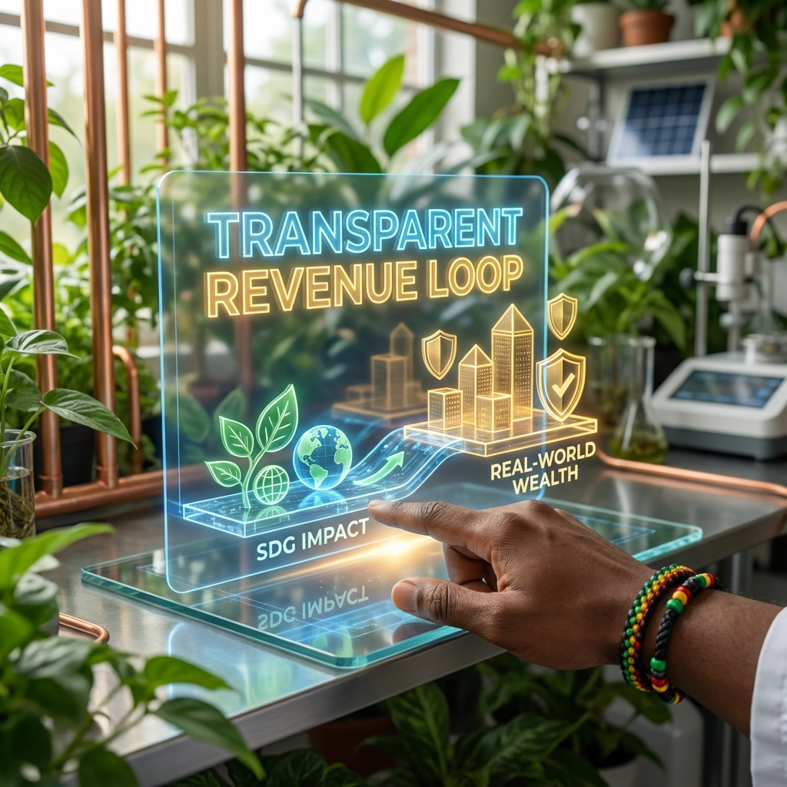

# Walkthrough: SDG Creative Director Transformation

**For the USFS Leadership Team.**
This document outlines the strategic foundation, visual identity, and execution plan for the SDG Passport Initiative.

## 1. The Strategy (The "Why")
*   **Vision & Strategy Map**: [SDG_Creative_Director_Vision_Map.md](SDG_Creative_Director_Vision_Map.md)
    *   *Core Concept*: **"Hybrid Intelligence"** (Merging Advanced Technology with Intuitive Wisdom).
    *   *Goal*: To transition from a "Student Club" to a "Venture Studio."

## 2. The Acceptance (The "How")
*   **Acceptance Email**: [Email_Draft_SDG_Creative_Director.md](Email_Draft_SDG_Creative_Director.md)
    *   *Tone*: Honorable, Innovative, Grounded.

## 3. The Visual Identity (The "Vibe")
*   **Style Guide**: [Visual_Identity_Guide.md](Visual_Identity_Guide.md)
    *   *Aesthetic*: **Solarpunk / Ethereal Tech**.
    *   *Key Standard*: **Representation Matters**. We honor Jamaican/Rastafarian roots and Diverse Collaboration.

### The Founder Vision (Definitive Edition)
*The Leader in the Lab: Connected to Earth, Powered by Data.*

## 4. The "Abundance Outcome" (The Money)
*   **Funding Strategy**: [Funding_Strategy.md](Funding_Strategy.md)
    *   *The Model*: **Transparent Revenue Loop**. We don't beg for grants; we build value.
    *   *The 3-Quote Rule*: How we ensure **Integrity** while hiring our own talent.

### The Financial Protocol
*Turning Impact into Assets.*

## 5. The "Deep Dive" (The Movie)
*   **The Video**: `assets/Founder_Vision_Video_Best.mp4`
    *   *The Hook*: "The Vision is Alive."

## 5. The Launch (Monday's Arsenal)
1.  **The Script**: [Monday_Meeting_Script.md](Monday_Meeting_Script.md) (Your Playbook).
2.  **The Media**: [Simple_Venture_Explainer.md](Simple_Venture_Explainer.md) (The 'Mystery' Video Script).
3.  **The Code**: Proceed to `npm run dev` to demonstrate the MVP.

---
**Status:** READY FOR LAUNCH. 🚀
